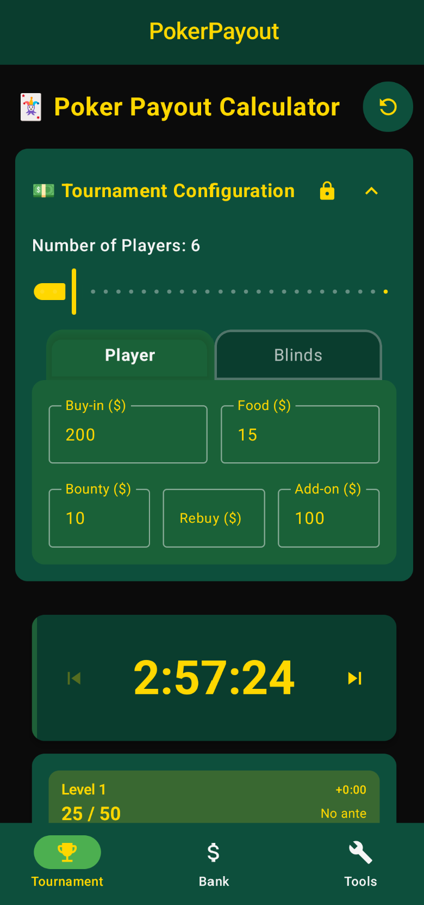
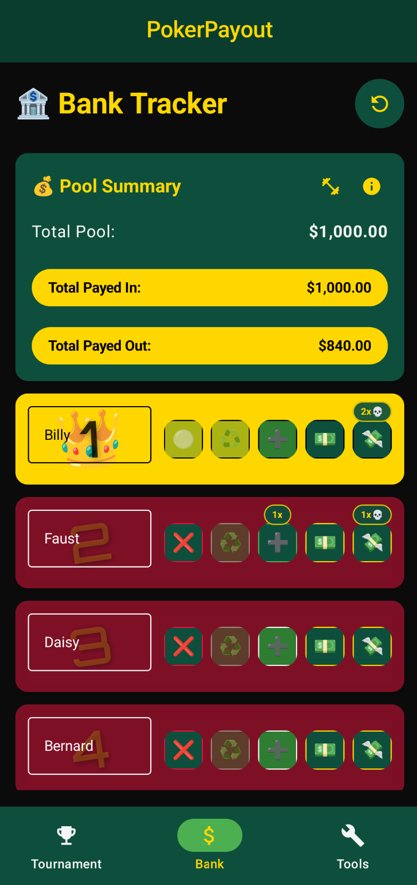
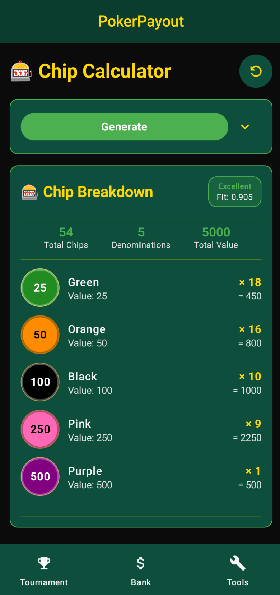
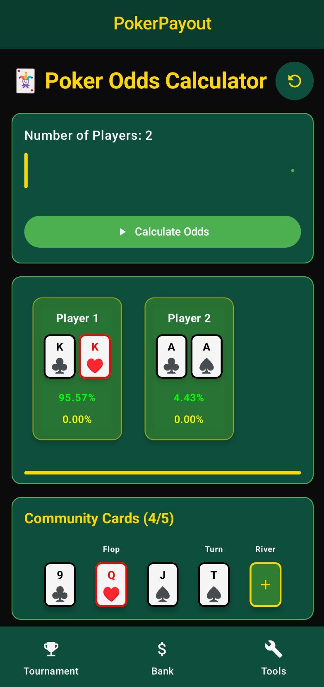

<a name="top"></a>

# Poker Payout Calculator 🃏

[](#)
[](#)
[](#)
[](https://github.com/HunterColes/PokerPayout/releases/latest)

[](LICENSE.md)
[](#-open-source--contributions)
[](#-how-to-contribute)

[](crypto/DONATIONS.md)
[](crypto/DONATIONS.md)

⭐ Star us on GitHub — your support motivates us a lot! 🙏😊

[](https://x.com/intent/tweet?text=Check%20out%20this%20project%20on%20GitHub:%20https://github.com/HunterColes/PokerPayout)
[](https://www.facebook.com/sharer/sharer.php?u=https://github.com/HunterColes/PokerPayout)
[](https://www.linkedin.com/sharing/share-offsite/?url=https://github.com/HunterColes/PokerPayout)
[](https://www.reddit.com/submit?title=Check%20out%20this%20project%20on%20GitHub:%20https://github.com/HunterColes/PokerPayout)
[](https://t.me/share/url?url=https://github.com/HunterColes/PokerPayout&text=Check%20out%20this%20project%20on%20GitHub)

---

## 🎯 What Is This?

**Poker Payout Calculator** is a professional, all-in-one poker tournament management app for Android. Whether you're hosting a home game or managing a casino tournament, this app has everything you need:

### **Purpose**
To provide poker tournament organizers and players with a complete toolkit for managing tournament payouts, tracking player payments, and timing blind levels with a beautiful poker-themed interface.

### **Description**
Poker Payout Calculator is a professional-grade tournament management application that:

- Calculates tournament payouts with customizable weight distributions
- Tracks player buy-ins, food pools, and bounty payments
- Provides real-time payment status and pool summaries
- Features a professional blind timer with countdown/countup modes
- Uses an authentic poker green color scheme
- Stores all data locally for privacy
- Provides a clean, intuitive interface optimized for tournament play
- Is completely free and open-source

### **Features**
- **🃏 Payout Calculator**: Configure tournament structure and calculate payouts with custom weights
- **🏦 Bank Tracker**: Track player payments with checkboxes for buy-in, food, and bounty
- **⏰ Blind Timer**: Professional tournament timer with visual progress indicators
	- Dynamic blind structure engine that scales blinds ~33% per level based on duration, round length, smallest chip, starting stack, and player count.
	- Skip forward/backward controls to preview upcoming levels or reset instantly from level one.
- **📊 Pool Management**: Real-time calculation of total pools and payment percentages
- **🎯 Tournament Tools**: Complete tournament management in one app

---

<p align="center">
	
	
	
	
</p>

---

### **Libraries/concepts used**

* Gradle modularised project by features
* MVVM pattern with modern Android architecture
* Jetpack Compose with Material3 design - for UI layer
* Kotlin Coroutines & Kotlin Flow - for concurrency & reactive approach
* Hilt - for Dependency Injection pattern implementation
* Room - for local database
* Version Catalog - for dependency management

---

## 🔨 Build & Installation (devs)

### Prerequisites

- Android Studio
- Java 17 (JDK 17) — required for building
- Android SDK (API 24+)

### **Commands** 🔨
Clean:
```
.\gradlew clean
```
Assemble Release APK:
```
.\gradlew assembleRelease
```
Install Release APK:
```
.\gradlew installRelease
```
Run Tests:
```
.\gradlew test
```

### **Release Signing** 🔐
For production releases (F-Droid, Play Store), uncomment and fill these lines in `gradle.properties`:

```bash
# In gradle.properties, uncomment and set:
RELEASE_STORE_PASSWORD=your_keystore_password_here
RELEASE_KEY_PASSWORD=your_key_password_here
```

Then run:
```bash
.\gradlew assembleRelease  # Creates signed APK
```

---

## 🌟 Support & Contributions

This project is support-driven and community-maintained. Contributions are welcome — bugs, docs, tests, UI tweaks, or code. To contribute:

1. Fork the repo
2. Create a feature branch
3. Open a pull request

For help or to discuss ideas, open an issue or a discussion on GitHub.

---

See also: [LICENSE.md](LICENSE.md) • [CONTRIBUTING.md](CONTRIBUTING.md) • [CODE_OF_CONDUCT.md](CODE_OF_CONDUCT.md)