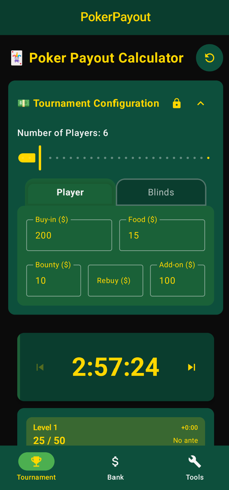
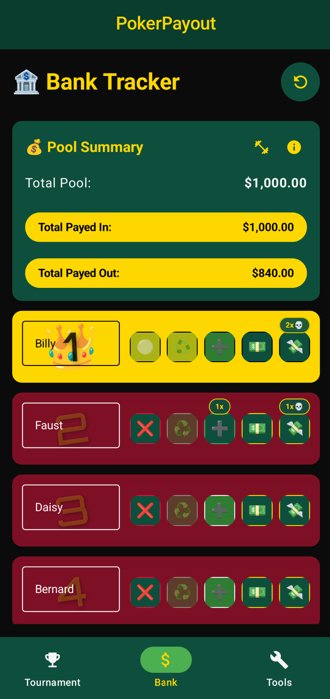
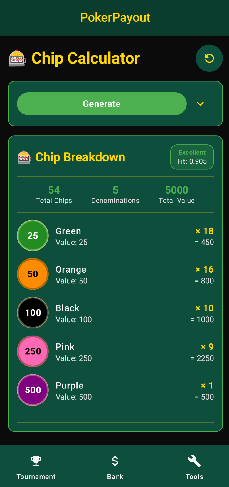
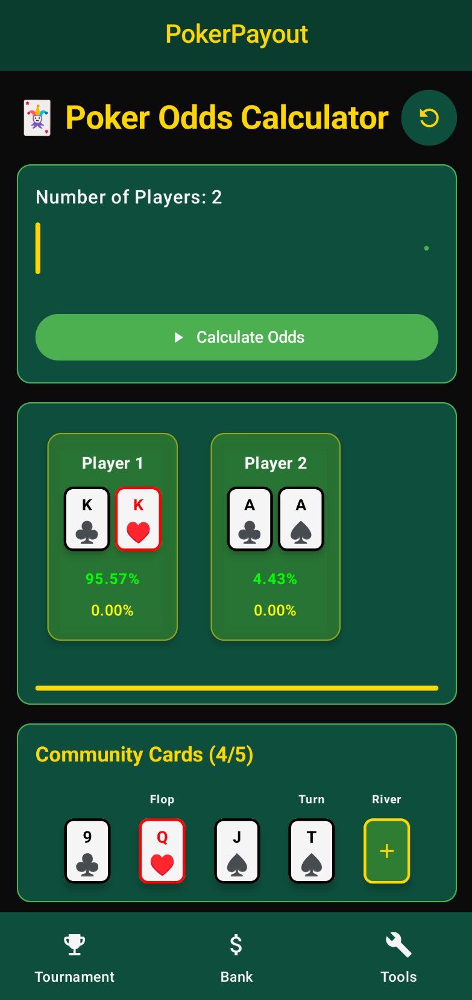

<p align="center">
  
</p>

<h1 align="center">Poker Payout</h1>

<p align="center">
  
  
  
</p>

<p align="center">
  
  
</p>

<h4 align="center">
  Professional poker tournament management with payouts, timers, and calculators for Android. Complete toolkit for home games and casino tournaments with beautiful poker-themed interface.
</h4>

# Download

<p align="center">
  <a href="https://github.com/HunterColes/PokerPayout/releases">
    
  </a>
  &nbsp;&nbsp;&nbsp;
  <a href="https://f-droid.org/packages/com.huntercoles.pokerpayout/">
    
  </a>
</p>

<p align="center">
  SHA-256 hash of the signing certificate: <code>0558e11420a97f212d7048f6b04351fdc82498f9d69cc5c0115270b5e2853de7</code><br>
  SHA-256 checksums are also provided per file on the <a href="https://github.com/HunterColes/PokerPayout/releases">GitHub releases page</a>.
</p>

<p align="center">
  
  
  
  
</p>

# Features

• **Tournament Management**
  ◦ Payout calculator with customizable weight distributions
  ◦ Bank tracker for buy-ins, food pools, and bounty payments
  ◦ Real-time payment status and pool summaries
  ◦ Professional blind timer with countdown/countup modes

• **Advanced Tools**
  ◦ Dynamic blind structure engine (scales ~33% per level)
  ◦ Skip forward/backward controls for level preview
  ◦ Chip distribution calculator
  ◦ Tournament setup and management

• **Design & Privacy**
  ◦ Authentic poker green color scheme
  ◦ Material 3 design with Jetpack Compose
  ◦ All data stored locally (no internet required)
  ◦ Clean interface optimized for tournament play

• **Free and Open Source**
• **Privacy-friendly**

---

# Build & Installation

## Prerequisites
- Android Studio
- Java 17 (JDK 17) — required for building
- Android SDK (API 26+)

## Build Commands
```bash
.\gradlew clean                    # Clean project
.\gradlew assembleRelease         # Build release APK
.\gradlew installRelease          # Install release APK
.\gradlew test                    # Run tests
.\gradlew --stop                  # Stop Gradle daemons (if stuck)
```

## Release Signing
For production releases, set environment variables:
```bash
export ORG_GRADLE_PROJECT_RELEASE_STORE_FILE="../pokerpayout-release.keystore"
export ORG_GRADLE_PROJECT_RELEASE_STORE_PASSWORD="your_password"
export ORG_GRADLE_PROJECT_RELEASE_KEY_ALIAS="pokerpayout"
export ORG_GRADLE_PROJECT_RELEASE_KEY_PASSWORD="your_password"
```

## F-Droid Reproducible Builds
For reproducible builds matching F-Droid:
```bash
docker-shell.bat                  # Start Linux container
dos2unix gradlew                  # Fix line endings (first time only)
./gradlew clean assembleRelease   # Build with Ubuntu 22.04 + Java 17
```

# Contribute

Pull requests are welcome. You can have a look at [issues](https://github.com/HunterColes/PokerPayout/issues) for contribution opportunities. For other changes, please open an issue first to discuss what you would like to change.

**How to contribute:**
1. Fork the repository
2. Create a feature branch
3. Open a pull request

For help or to discuss ideas, open an issue or a discussion on GitHub.

# Libraries & Architecture

• Gradle modularised project by features
• MVVM pattern with modern Android architecture  
• Jetpack Compose with Material 3 design
• Kotlin Coroutines & Flow for concurrency
• Hilt for Dependency Injection
• Room for local database
• Version Catalog for dependency management

# License

• [MIT License](LICENSE.md)
• Free and open source software
• See also: [CONTRIBUTING.md](CONTRIBUTING.md) • [CODE_OF_CONDUCT.md](CODE_OF_CONDUCT.md)