<!--
  Pictures on this page update themselves:
  - the row under the badges is the store listing (metadata/en-US/images/phoneScreenshots/),
    re-shot on GitHub's emulator by .github/workflows/listing.yml;
  - the pictures in "What's inside" are screenshot-test goldens (*/src/test/screenshots/), which CI
    checks on every push and goldens.yml re-records, so they always match the code.
  Renaming a screen test renames its golden: update the path here too.
-->

<p align="center">
  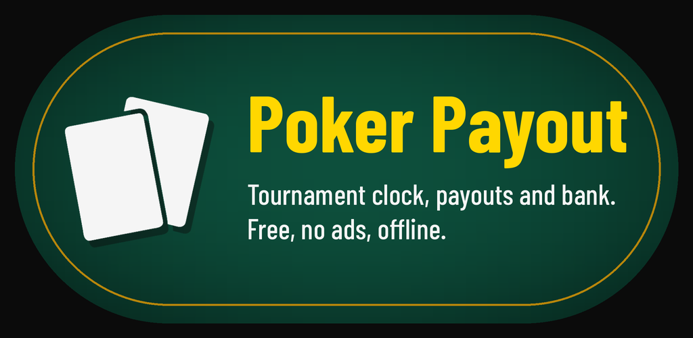
</p>

<p align="center"><b>A free Android app for home poker nights.</b></p>

<p align="center">
  A tournament clock with blinds that fit your chips, payouts that add up to the cent, a bank of
  who paid what, and tools for the table. Offline, no ads, no accounts.
</p>

<p align="center">
  <a href="https://f-droid.org/packages/com.huntercoles.pokerpayout/"></a>
  &nbsp;
  <a href="https://github.com/HunterColes/PokerPayout/releases/latest"></a>
</p>

<p align="center">
  <a href="https://github.com/HunterColes/PokerPayout/releases/latest"></a>
  <a href="https://github.com/HunterColes/PokerPayout/actions/workflows/ci.yml"></a>
  
  
  <a href="LICENSE.md"></a>
  <a href="#support-the-app"></a>
</p>

<p align="center">
  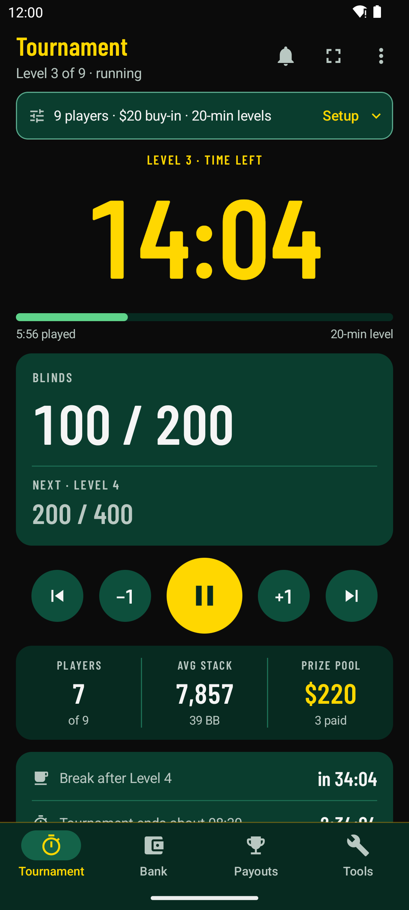
  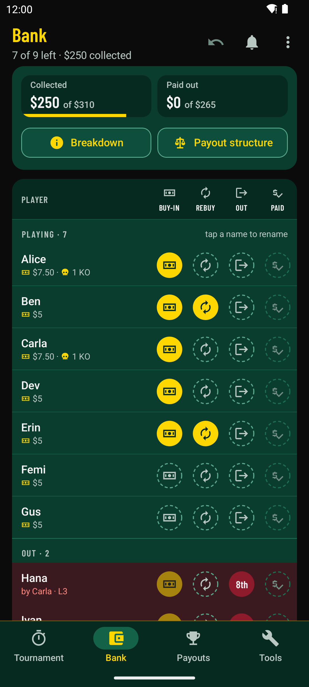
  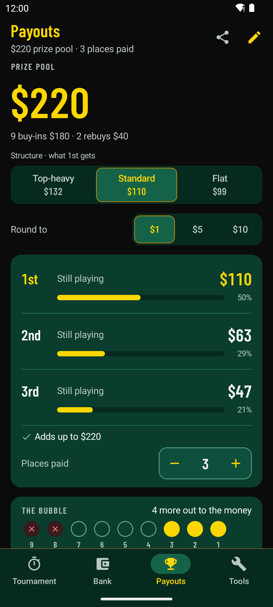
  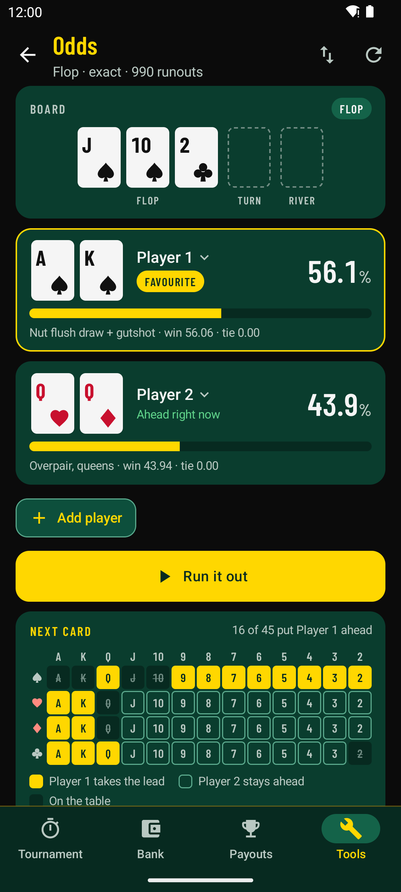
</p>

## What's inside

### Tournament

- Set up the night once: players, buy-in, bounty, rebuys (with a cutoff level), add-ons and food.
  Save it as a preset and load it next time.
- Blinds from four numbers: game length, level length, starting stack and smallest chip. Every
  level is a multiple of your smallest chip, and a setup that can't work says why and offers the
  nearest fix.
- A clock with big digits, the next level, ±1 minute nudges, breaks with a note and a big-blind
  ante. It keeps time through sleep, restarts and reboots.
- The running clock in the notifications and on the lock screen, with a chime, a vibration or a
  flash at each new level.
- Color-ups on breaks, overtime levels if the game runs long, and a full-screen table view when
  you turn the phone sideways.
- Share the setup as text for the group chat.

<p align="center">
  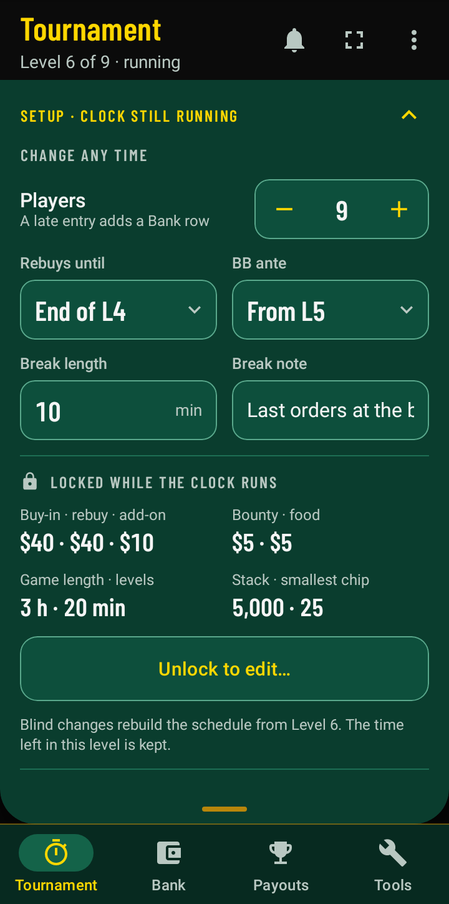
  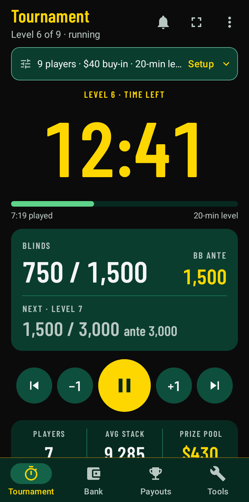
  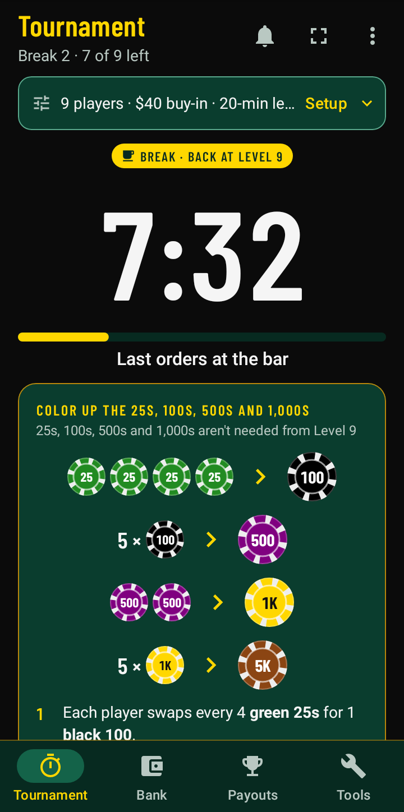
  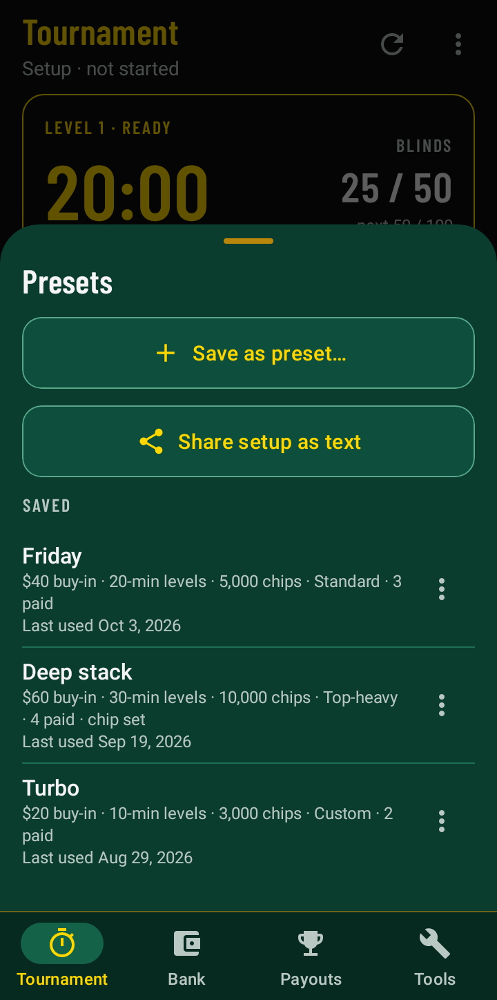
</p>

### Bank

- Who has paid the buy-in, rebuys and add-ons, and who has been paid out, with Undo.
- Knockouts and bounties three ways: standard, progressive (half now, half onto the winner's own
  bounty) or mystery envelopes.
- Settle up at the end of the night: the fewest payments that square everyone, with a tick for
  each, when not everyone paid in at the start.
- Share the settle-up as text.

<p align="center">
  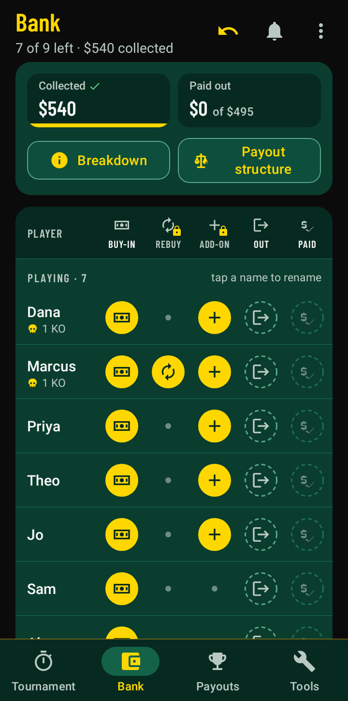
  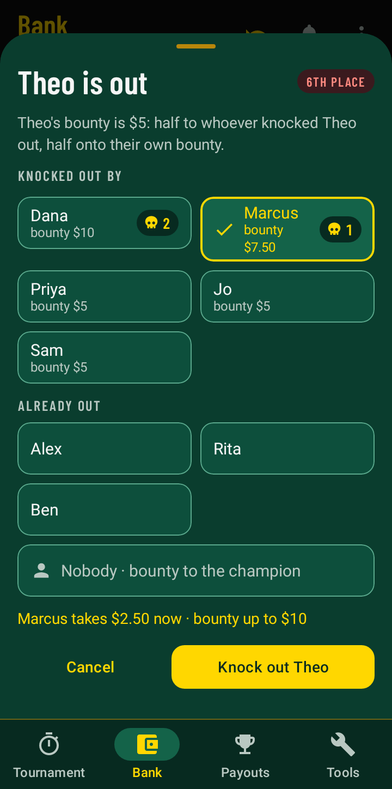
  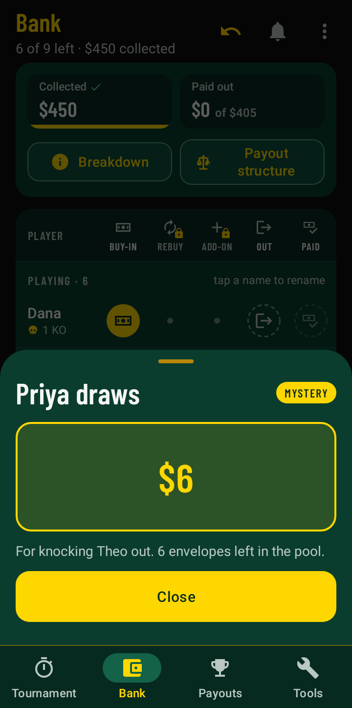
  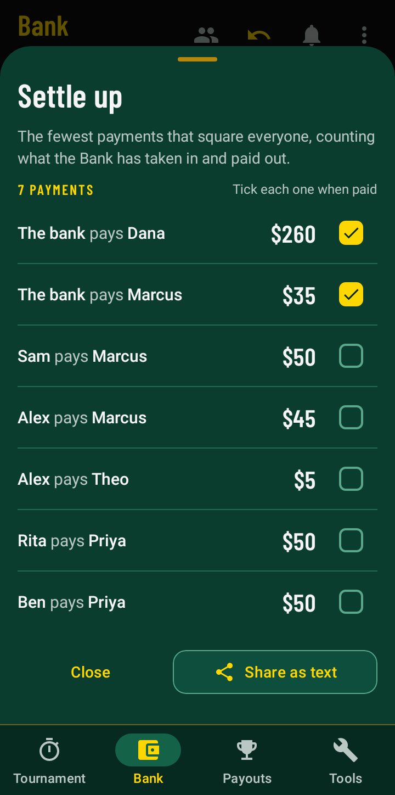
</p>

### Payouts

- Top-heavy, standard or flat, or your own weights, rounded to $1, $5 or $10.
- The places always add up to the prize pool, to the cent.
- Share the payouts as text, and save the night to History once everyone is paid.

<p align="center">
  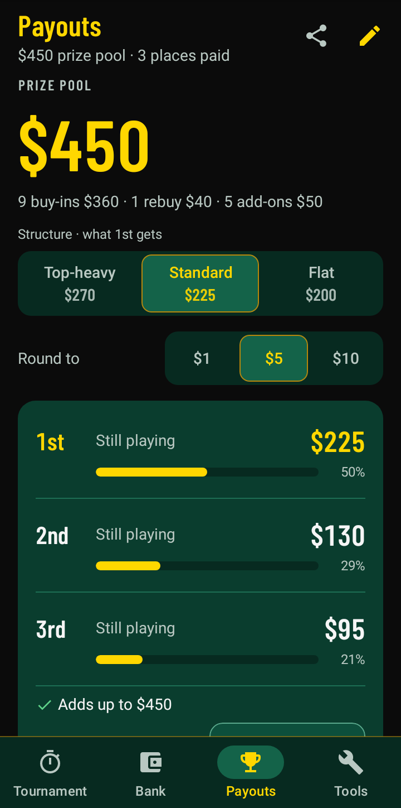
  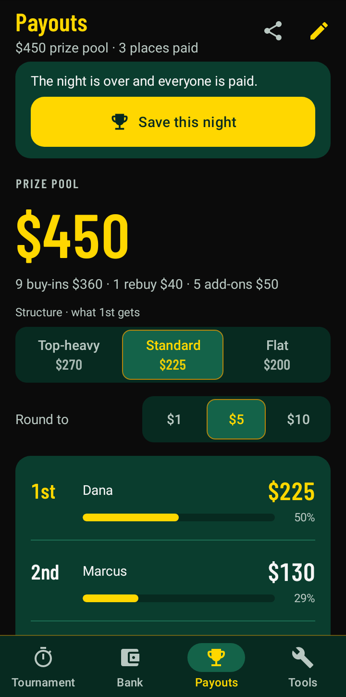
</p>

### Tools

- **Odds** for two to ten hands (exact, or a close estimate when there are too many runouts),
  and run it out card by card.
- **Hand ranks:** what beats what, with how often each hand comes up.
- **Chip set:** stacks from the chips you own, and a color-up plan.
- **Seat draw:** random, balanced seats across your tables, and the high card for the button.
- **History:** saved nights, season points and the player of the year, and a CSV export for a
  spreadsheet.
- **Sound:** a chime before each level, break and the end; vibrate and flash for quiet rooms.

<p align="center">
  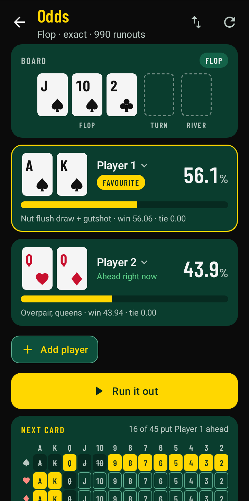
  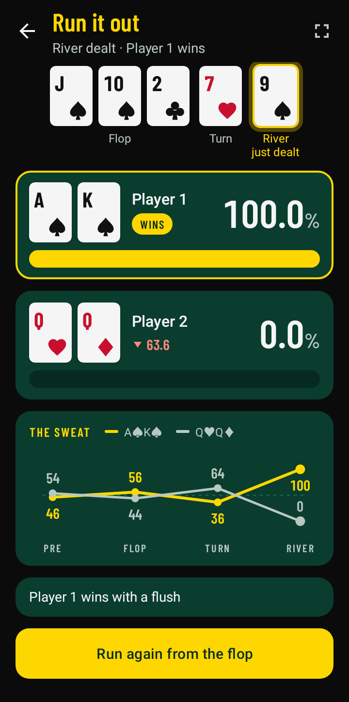
  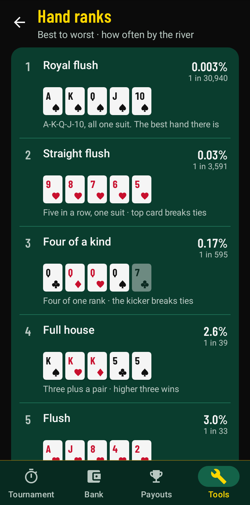
</p>
<p align="center">
  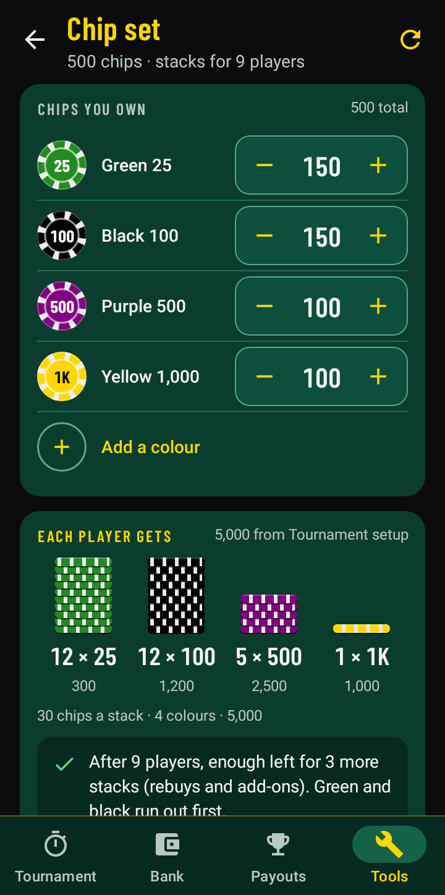
  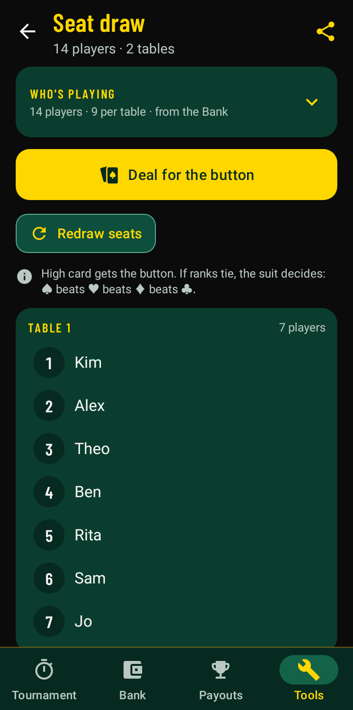
  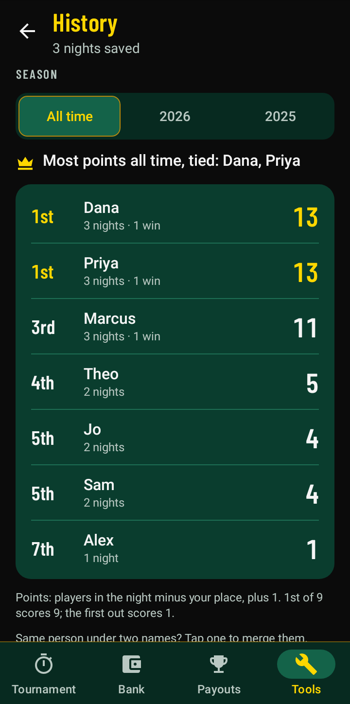
</p>

<sub>The pictures in this section come from the app's screenshot tests. A change to a screen can't
merge until they're updated, so they always show the app as it is today.</sub>

## Private by design

- **No internet permission.** The app can't go online, so nothing you type can leave your phone
  through it.
- **No ads, no accounts, no analytics, no tracking.**
- **Your data stays on your phone,** in the app's own storage. Something leaves only when you tap
  Share or Export and pick where it goes.

The details are in [PRIVACY.md](PRIVACY.md).

## Install

- **[F-Droid](https://f-droid.org/packages/com.huntercoles.pokerpayout/)** (recommended): updates
  arrive by themselves. F-Droid builds each release from this source and checks it matches ours
  byte for byte, so it can be a few days behind GitHub.
- **[GitHub releases](https://github.com/HunterColes/PokerPayout/releases/latest):** download
  `PokerPayout-v….apk` on your phone and open it. Android may ask you to allow installs from your
  browser or files app.

Needs Android 8.0 or newer.

> **Coming from 1.1.x?** The signing key changed in 1.2.0, so Android can't update over it.
> Uninstall Poker Payout once, then install the new version. Uninstalling deletes saved data.
> Later updates install normally.

## Support the app

Poker Payout is free: no ads, nothing locked, nothing to sign up for. If it has run a few of your
poker nights and you'd like to say thanks, a donation is the nicest way. It pays for the time that
goes into new features and fixes.

**[Donate in Ethereum or Monero](crypto/DONATIONS.md)** (addresses and QR codes)

No crypto? These help just as much, and cost nothing:

- Star the repository, so more people find it.
- Tell your poker group, or the next home game you play in.
- [Report a bug or suggest an idea](https://github.com/HunterColes/PokerPayout/issues/new/choose).

Thank you. Every bit of support is noticed.

## Build and contribute

Bug reports and ideas are welcome: the [issue forms](https://github.com/HunterColes/PokerPayout/issues/new/choose)
ask for what's needed. For code, start with [CONTRIBUTING.md](CONTRIBUTING.md).

You need JDK 21 and the Android SDK (API 34). The modules target Java 17 bytecode but build with
a JDK 21 toolchain, the same JDK F-Droid builds with.

```bash
./gradlew assembleDebug                         # debug APK in app/build/outputs/apk/debug/
./gradlew testDebugUnitTest lintDebug detekt    # what CI checks on every push and pull request
```

- [docs/TESTING.md](docs/TESTING.md): unit tests, screenshot tests and the device tour.
- [docs/RELEASING.md](docs/RELEASING.md): releases, signing and F-Droid's reproducible builds.

**Built with** Kotlin, Jetpack Compose and Material 3. One module per tab (tournament, bank,
tools) on a shared core with the design system. Each screen is MVI: a ViewModel, its UI state and
intents, and a stateless composable. Hilt for dependency injection, Kotlin Coroutines and Flow,
settings and game state in SharedPreferences, and a version catalog for dependencies.

## Licence and credits

Made by **Hunter Coles** (owner and maintainer) with **Joshua Glenn** (co-author).

- [MIT License](LICENSE.md): free and open source.
- Font: [Barlow Condensed](https://github.com/jpt/barlow) by Jeremy Tribby, SIL Open Font License
  1.1 ([licence text](core/src/main/assets/licenses/OFL-BarlowCondensed.txt), shipped in the app).
- Icons: Material Symbols paths (Apache License 2.0), plus suits, chips and cards drawn for Poker
  Payout.

[Contributing](CONTRIBUTING.md) · [Code of conduct](CODE_OF_CONDUCT.md) ·
[Security](SECURITY.md) · [Privacy](PRIVACY.md) · [Changelog](CHANGELOG.md)
