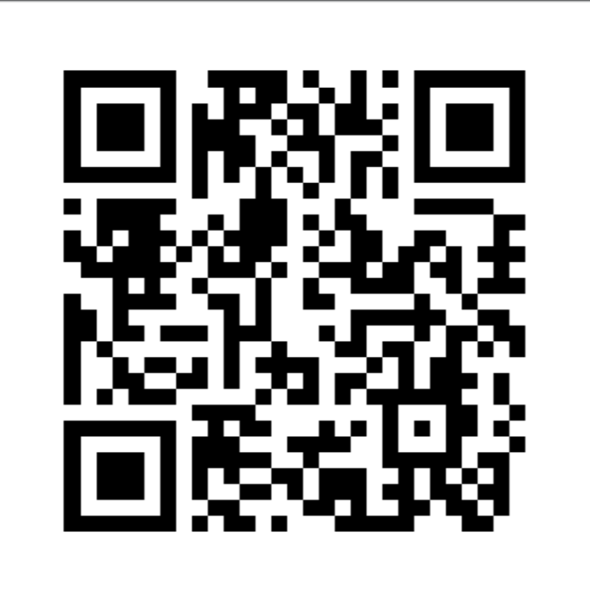
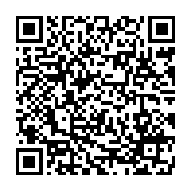

<h1 align="center">Tip the dealer</h1>

  Poker Payout is free, with no ads, no accounts and nothing locked. 
  If it has made your poker nights easier, a tip is a kind way to say thanks. 
  It pays for the time that goes into new features and fixes. Nothing changes if you don't.

---

   
  <strong>Ethereum (ETH)</strong> 
  <code>0xb93CD995950AD1E016c9Bf173999A887Bc181fED</code>

   
  <strong>Monero (XMR)</strong> 
  <code>4ANUxAZ5Ra3FewyyiHnKKahetsvXLMgocCwEiYeK1qDLjCjxSJS275XRvpZ1JRMWjvLS5xDYzwjESY2qF4UE4v1R2cz1QeU</code>

Scan the code with your wallet, or copy the address. Check the first and last few characters before you send.

The app shows the same addresses and codes offline, under <strong>Tools &gt; Tip the dealer</strong>.

---

## Free ways to help

They cost nothing and help just as much:

- **Tell your poker group**, or the next host you play with.
- **Star the repository** on GitHub, so more people find it.
- **Report a bug or suggest an idea:** [open an issue](https://github.com/HunterColes/PokerPayout/issues/new/choose).
- **Contribute code:** see [CONTRIBUTING.md](../CONTRIBUTING.md).

Thank you. Every bit of support is noticed.

[Back to the README](../README.md)
